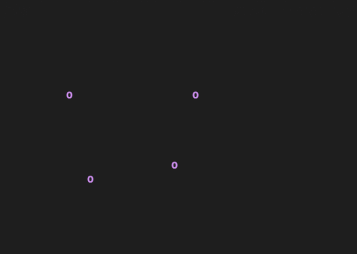

# rust-rain

A console screensaver inspired by
[BSD rain](https://github.com/NetBSD/src/blob/trunk/games/rain/rain.c). The original
[`rain`](https://github.com/NetBSD/src/blob/trunk/games/rain/rain.c) was authored by
Eric P. Scott in 1980 (!).

    

## Installing

You can `git clone` this repository and run `cargo build` followed by `cargo run`.
Precompiled binaries are available for a few platforms at the
[releases page](https://github.com/wickedchicken/rust-rain/releases). Note that due to the
dependency on [termion](https://github.com/redox-os/termion), this currently does not work
under Windows.

## Running

The `rain` binary runs with defaults, but `--help` shows the configurable options. If
running with `cargo`, you will have to separate out the arguments from arguments to
`cargo` itself: `cargo run -- --help`.

## Contributing

Feel free to create an issue or submit a PR!
